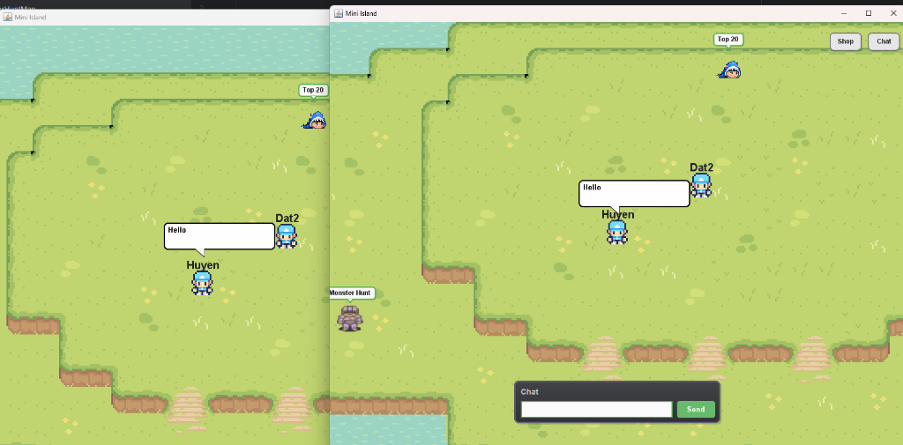
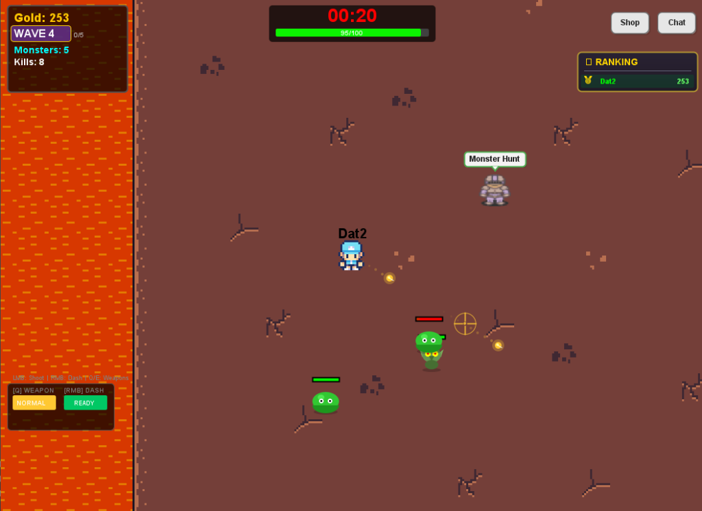
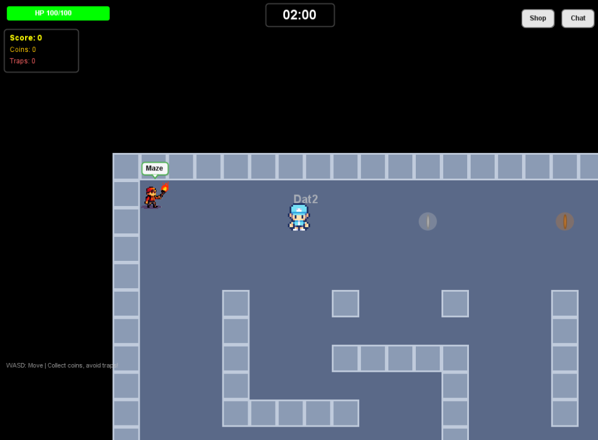
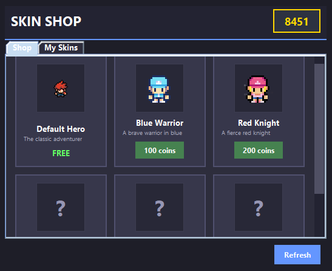
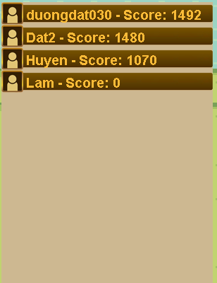

# Mini Island 2D - Client

[](https://adoptium.net/)
[](https://maven.apache.org/)
[](https://github.com/TooTallNate/Java-WebSocket)
[](LICENSE)

> A real-time multiplayer 2D top-down game built with **Java Swing/AWT** and **WebSockets**, featuring synchronized multiplayer exploration, fast-paced monster hunt combat, timed maze survival, speech bubble chat, cosmetic skin shop, and live global rankings.

---

## Gameplay & Preview Showcase

### Real-time Multiplayer Island & Chat

*Synchronized multiplayer lobby with real-time movement, interactive speech bubbles, and global chat box.*

---

### Monster Hunt (Wave Defense Combat)

*Survival wave defense mode featuring crosshair aiming, projectile shooting, dash mechanics, gold rewards, and dynamic wave scaling.*

---

### Maze Exploration & Coin Collection

*Timed maze exploration mode where players collect coins, navigate dark corridors, dodge traps, and race against the 2-minute timer.*

---

### Skin Shop & Live Leaderboard

| Cosmetic Skin Shop | Global Leaderboard |
| :---: | :---: |
|  |  |
| *Spend earned gold coins to unlock and equip unique character skins.* | *Real-time player ranking and score synchronization.* |

---

## Key Features

- **Real-Time Multiplayer Networking**: Low-latency player synchronization, movement interpolation, and game state updates powered by WebSockets.
- **Interactive Island Lobby**: Shared world where players can explore, meet up, chat via overhead speech bubbles, and interact with mode NPCs.
- **Monster Hunt Combat Mode**: 
  - Wave-based survival against evolving monsters.
  - Mouse crosshair targeting with fluid projectile shooting.
  - Dash ability (`[RMB]`) for evasive maneuvering.
  - Gold economy, kill tracking, damage numbers, and wave leaderboards.
- **Maze Exploration Mode**: 
  - 2-minute timed maze navigation with torch guide NPC.
  - Collect coins scattered across corridors to rack up scores.
  - Trap avoidance and real-time HP & trap stats tracking.
- **Overhead Speech Bubbles & Global Chat**: Dynamic chat system rendering dialog bubbles directly above player heads alongside a dedicated chat pane.
- **Skin Customization Shop**: In-game marketplace to purchase and switch between character skins (Default Hero, Blue Warrior, Red Knight, etc.) using in-game currency.
- **Live Leaderboard**: Global high-score tracking synced in real time across active game sessions.
- **Custom 2D Graphics Engine**: Pure Java AWT/Swing rendering engine with custom pixel art fonts, tilemap system, and sprite sheet animations.

---

## Controls

| Key / Input | Action |
| :--- | :--- |
| `W`, `A`, `S`, `D` / `Arrow Keys` | Move Character |
| `Left Mouse Button (LMB)` | Shoot / Attack towards crosshair |
| `Right Mouse Button (RMB)` | Dash (Quick Dodge) |
| `Q` / `E` | Switch Weapon |
| `Space` | Place Bomb (Maze / PvP mode) |
| `Enter` | Focus / Send Chat Message |
| `Shop / Top 20 Buttons` | Open In-Game Menus & Leaderboard |

---

## Technology Stack

- **Language**: Java 17 (LTS)
- **Graphics & UI**: Java Swing / AWT (Custom rendering pipeline)
- **Networking**: [Java-WebSocket 1.5.3](https://github.com/TooTallNate/Java-WebSocket)
- **Serialization**: JSON message protocol
- **Build Tool**: Apache Maven

---

## Project Structure

```
miniisland-2.0/
├── src/
│   ├── collision/                # Bounding box & map collision detection
│   ├── font/                     # Custom pixel art font rendering
│   ├── imageRender/              # Image caching and sprite loader
│   ├── input/                    # Keyboard & Mouse input listeners
│   ├── main/                     # Game loop, scenes & launcher
│   │   ├── Main.java             # Entry point
│   │   ├── MiniIsland.java       # Core game panel & loop
│   │   └── GameScene.java        # Scene manager
│   ├── maps/                     # Tilemaps (Island, Maze, Monster Hunt)
│   ├── network/                  # WebSocket client & packet protocol
│   │   ├── client/               # Connection & receiving thread
│   │   ├── entitiesNet/          # Multiplayer synchronized entities
│   │   └── leaderBoard/          # Leaderboard networking & UI
│   ├── objects/                  # Game entities
│   │   └── entities/             # Player, Monster, NPC, Bullet, DamageNumber
│   └── panes/                    # UI Panels
│       ├── auth/                 # Sign-in & Sign-up dialogs
│       ├── chat/                 # Chat input & bubble renderer
│       ├── loading/              # Loading screen
│       └── shop/                 # Skin shop interface
├── Resource/                     # Visual & Audio assets
│   ├── Chat/                     # Chat UI graphics
│   ├── font/                     # TTF & pixel font assets
│   ├── LeaderBoard/              # Leaderboard UI textures
│   ├── Login/                    # Auth background & buttons
│   ├── Maps/                     # Tile sets & CSV map data
│   ├── NPC/                      # NPC character sprites
│   ├── player/                   # Player sprite sheets & skins
│   └── Ui/                       # HUD & button elements
├── screenshots/                  # Preview screenshots for documentation
└── pom.xml                       # Maven dependencies & build configuration
```

---

## Getting Started

### Prerequisites
- **Java 17 JDK** or higher ([Download Eclipse Temurin](https://adoptium.net/temurin/releases/?version=17))
- **Apache Maven** (for CLI builds)
- **Mini Island Server** running and accessible

### Installation & Execution

1. **Clone the repository:**
   ```bash
   git clone https://github.com/duongdatdev/miniisland-2.0.git
   cd miniisland-2.0
   ```

2. **Build the project:**
   ```bash
   mvn clean compile
   ```

3. **Run the client:**
   ```bash
   mvn exec:java -Dexec.mainClass="main.Main"
   ```

---

## Network Protocol Overview

The client communicates with the server via structured JSON WebSocket messages:

- **Authentication**: `{"type": "login", "username": "...", "password": "..."}`
- **Position Sync**: `{"type": "move", "direction": "...", "x": 120, "y": 340}`
- **Combat Events**: `{"type": "shoot", "targetX": 450, "targetY": 300, "weapon": "NORMAL"}`
- **Chat & Speech Bubbles**: `{"type": "chat", "message": "Hello everyone!"}`
- **Shop Purchases**: `{"type": "buy_skin", "skinId": "blue_warrior"}`

---

## License

This project is licensed under the [MIT License](LICENSE).
